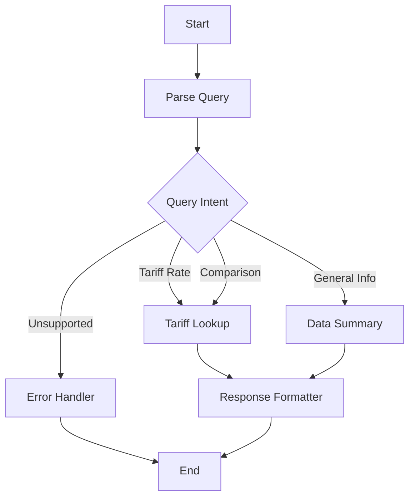

# 🏭 TariffTok AI - Advanced Tariff Analysis System

[](https://python.org)
[](https://fastapi.tiangolo.com)
[](https://langchain-ai.github.io/langgraph/)
[](https://azure.microsoft.com/en-us/products/ai-services/openai-service)

> **Agentic tariff analysis system using LangGraph for dynamic multi-agent orchestration**

TariffTok AI is a sophisticated **agentic** tariff analysis platform that leverages Azure OpenAI and LangGraph to provide intelligent, autonomous analysis of international trade tariffs. Built for the Women Who Code TechFutures 2025 conference, this system demonstrates advanced **agentic AI** orchestration patterns where multiple specialized agents work together autonomously to solve complex business problems.

## 🎯 Why This App Was Created

### 🌍 **Real-World Business Problem**
International trade tariffs are complex, constantly changing, and critical for business decision-making. Companies importing/exporting goods need quick access to:
- Current tariff rates across different countries
- Historical trends and rate changes
- Comparative analysis for sourcing decisions
- Impact assessment of tariff policy changes

### 🤖 **Agentic AI Technology Demonstration**
This project showcases cutting-edge **agentic AI** technologies in a practical business context:

**Autonomous Agent Orchestration**: Demonstrates how multiple specialized agents can work together autonomously, making independent decisions about routing execution based on user intent rather than following rigid, predetermined paths.

**Self-Directing Workflows**: Shows how agents can dynamically determine their own execution paths, collaborate with other agents, and adapt their behavior based on context and data availability.

**Intelligent Agent Coordination**: Proves that complex business queries can be handled through autonomous agent collaboration, where each agent specializes in specific tasks and coordinates seamlessly with others.

### 👩‍💻 **Women Who Code TechFutures 2025**
Created specifically for the Women Who Code TechFutures 2025 conference to:

- **Inspire Women in Tech**: Demonstrate that women can build sophisticated AI systems that solve real business problems
- **Showcase Advanced Patterns**: Present modern **agentic AI** orchestration techniques that are relevant in today's industry
- **Provide Learning Resource**: Serve as a comprehensive example for learning **agentic systems**, LangGraph, FastAPI, and Azure OpenAI
- **Encourage Innovation**: Show how **autonomous agents** can democratize access to complex business intelligence

### 🏢 **Industry Relevance**
The tariff analysis domain was chosen because:

- **High Business Impact**: Tariff decisions affect millions of dollars in trade costs
- **Complex Data Relationships**: Requires sophisticated query parsing and data correlation
- **Real-Time Requirements**: Businesses need up-to-date information for decision-making
- **Multi-Stakeholder Value**: Benefits importers, exporters, logistics companies, and policy makers

### 🔬 **Technical Innovation Goals**
This project pushes the boundaries of what's possible with **agentic AI** orchestration:

- **Autonomous Decision Making**: Unlike traditional chatbots, agents make independent decisions about execution paths and collaborate dynamically
- **Self-Adapting Workflows**: Agents adapt their behavior based on context, data availability, and previous execution results
- **Intelligent Error Recovery**: Agents autonomously detect errors, attempt recovery strategies, and gracefully handle failures
- **Collaborative Intelligence**: Multiple agents work together, sharing context and coordinating their specialized capabilities

### 📚 **Educational Value**
Beyond the business application, this project serves as a comprehensive learning resource for:

- **Agentic Architecture Patterns**: How to design scalable, autonomous agent systems
- **Multi-Agent Orchestration**: Best practices for coordinating autonomous agents
- **Agent Communication Protocols**: Creating interfaces for agent-to-agent and agent-to-human interaction
- **Production Considerations**: Error handling, monitoring, and deployment strategies for agentic systems

### 🌟 **Future Vision**
This project demonstrates the potential for **agentic AI** to transform how businesses access and analyze complex data:

- **Autonomous Business Intelligence**: Agents that independently research, analyze, and present insights
- **Self-Managing Workflows**: Agents that adapt and optimize their own processes based on results
- **Scalable Agent Ecosystems**: Patterns for building networks of specialized agents across business domains
- **Human-Agent Collaboration**: Showing how autonomous agents augment rather than replace human expertise

## 🌟 Key Features

### 🤖 **Autonomous Agent Orchestration**
- **Dynamic LangGraph Pipeline**: Agents autonomously determine execution paths based on query intent
- **Multi-Agent Architecture**: Specialized autonomous agents for parsing, lookup, formatting, and error handling
- **Real-time Execution Tracking**: Live monitoring of autonomous agent execution paths
- **Graphviz Visualization**: Interactive execution flow diagrams showing agent collaboration

### 💬 **Agentic Conversational Interface**
- **Natural Language Queries**: Ask questions in plain English, agents autonomously interpret and respond
- **Contextual Agent Responses**: Autonomous agents generate insights with business intelligence
- **Interactive Charts**: Dynamic data visualization with Chart.js, generated by specialized agents
- **Slack Integration**: Agents autonomously share analysis results directly to Slack

### 📊 **Comprehensive Data Analysis**
- **Multi-Country Support**: China, Vietnam, Mexico, India, USA
- **Product Categories**: Electronics, Apparel, Home Goods, Toys
- **Historical Analysis**: Trend analysis and rate change tracking
- **Comparison Tools**: Side-by-side country and product comparisons

### 🔧 **Advanced Agentic Technical Features**
- **Azure OpenAI Integration**: GPT-4 powered autonomous agent reasoning
- **FastAPI Backend**: High-performance async API for agent communication
- **Pydantic Validation**: Type-safe data models for agent state management
- **Autonomous Error Recovery**: Agents gracefully handle errors and provide user guidance

## 🚀 Quick Start

### Prerequisites
- Python 3.8 or higher
- Azure OpenAI service account
- Git

### 1. Clone the Repository
```bash
git clone https://github.com/your-username/demo-tarifftok-workshop.git
cd demo-tarifftok-workshop
```

### 2. Install Dependencies
```bash
pip install -r requirements.txt
```

### 3. Configure Environment
```bash
# Copy the environment template
cp config/env/env.template .env

# Edit .env with your Azure OpenAI credentials
nano .env
```

**Required Environment Variables:**
```env
AZURE_OPENAI_API_KEY=your_azure_openai_api_key_here
AZURE_OPENAI_ENDPOINT=https://your-resource.openai.azure.com/
AZURE_OPENAI_DEPLOYMENT_NAME=your_deployment_name
AZURE_OPENAI_MODEL_NAME=gpt-4o
```

> ⚠️ **Security Note**: Never commit your `.env` file to version control. The `.gitignore` file is configured to exclude sensitive credentials.

### 4. Generate Sample Data
```bash
# Generate synthetic tariff data
python data/src/data_generation/"Generate synthetic datasets for tariff.py"
```

### 5. Start the Application
```bash
# Option 1: Use the startup script (recommended)
python start.py

# Option 2: Direct FastAPI server
python -m uvicorn src.main:app --host 0.0.0.0 --port 8080 --reload
```

### 6. Access the Application
Open your browser to: **http://localhost:8080**

## 📖 Usage Examples

### Basic Tariff Queries
```
"What's the tariff rate for Electronics from China?"
"How much tariff is charged on Toys from Vietnam?"
"Compare tariff rates for Electronics between China and Vietnam"
```

### Advanced Analysis
```
"What data do you have available?"
"Show me historical tariff changes for Apparel from Mexico"
"Which country has the lowest tariffs for Home goods?"
```

### Business Intelligence
```
"Analyze the cost impact of 5% tariff increase on Electronics from China"
"What are the trends in tariff rates for Toys over the past year?"
"Compare total import costs for Electronics from all supported countries"
```

## 🏗️ System Architecture

### LangGraph Implementation
The system implements a dynamic LangGraph-style pipeline with the following components:



### Agent Architecture
- **Query Parser Agent**: Analyzes user queries using Azure OpenAI
- **Tariff Lookup Agent**: Retrieves and processes tariff data
- **Response Formatter Agent**: Generates natural language responses
- **Data Summary Agent**: Provides database overviews
- **Error Handler Agent**: Manages errors and provides guidance
- **Dynamic Router Agent**: Routes execution based on query intent

### Data Flow
1. **User Input**: Natural language query via web interface
2. **Query Parsing**: LLM analyzes intent and extracts parameters
3. **Dynamic Routing**: System determines execution path
4. **Data Retrieval**: Tariff data fetched from CSV database
5. **Response Generation**: LLM formats response with insights
6. **Visualization**: Charts and graphs generated for comparisons

## 📁 Project Structure

```
demo-tarifftok-workshop/
├── README.md                           # This file
├── start.py                            # Application startup script
├── requirements.txt                    # Python dependencies
├── Dockerfile                          # Container configuration
├── config/                             # Configuration files
│   └── env/
│       ├── env.template                # Environment template
│       └── env.production.template     # Production template
├── src/                                # Main application code
│   ├── main.py                         # FastAPI application
│   ├── core/                           # Core system components
│   │   ├── config.py                   # Configuration management
│   │   ├── data_loader.py              # Data loading utilities
│   │   ├── dynamic_pipeline.py         # LangGraph pipeline
│   │   ├── models.py                   # Pydantic data models
│   │   └── pipeline.py                 # Legacy pipeline
│   └── agents/                         # LangGraph agents
│       ├── query_parser.py             # Query analysis agent
│       ├── tariff_lookup.py            # Data retrieval agent
│       ├── response_formatter.py       # Response generation agent
│       ├── data_summary.py            # Database overview agent
│       ├── error_handler.py           # Error handling agent
│       └── dynamic_router.py          # Routing agent
├── data/                               # Data management system
│   ├── README.md                       # Data system documentation
│   ├── requirements.txt                # Data system dependencies
│   ├── data_viewer_crud.html          # CRUD-enabled viewer
│   ├── data_viewer_dynamic.html        # Dynamic viewer
│   ├── retail_tariff_data/            # Generated CSV data
│   │   ├── tariffs.csv                # Main tariff data
│   │   ├── products.csv               # Product catalog
│   │   ├── suppliers.csv               # Supplier information
│   │   ├── markets.csv                # Market definitions
│   │   ├── cost_transit.csv           # Cost and transit data
│   │   ├── sales_daily.csv            # Daily sales data
│   │   ├── sales_weekly.csv           # Weekly sales data
│   │   └── DATA_DICTIONARY.md         # Data documentation
│   ├── src/                           # Data system source
│   │   ├── data_generation/            # Data generation scripts
│   │   ├── server/                    # Data server components
│   │   └── viewers/                   # HTML viewer generators
│   ├── scripts/                       # Utility scripts
│   └── docs/                          # Data system documentation
├── docs/                              # Project documentation
│   └── LANGGRAPH_FLOW_DEFINITION.md   # LangGraph implementation guide
└── static/                            # Static web assets
    └── images/                        # Images and icons
```

## 🔧 Configuration

### Environment Variables
The application uses environment variables for configuration. Copy `config/env/env.template` to `.env` and customize:

```env
# Azure OpenAI Configuration (Required)
AZURE_OPENAI_API_KEY=your_api_key
AZURE_OPENAI_ENDPOINT=https://your-resource.openai.azure.com/
AZURE_OPENAI_DEPLOYMENT_NAME=your_deployment
AZURE_OPENAI_MODEL_NAME=gpt-4o

# Slack Integration (Optional)
SLACK_WEBHOOK_URL=https://hooks.slack.com/services/YOUR/WEBHOOK/URL

# Application Settings
APP_ENV=development
DEBUG=false
HOST=0.0.0.0
PORT=8080
```

### Data Configuration
The system uses CSV files for tariff data. Data is automatically generated but can be customized:

- **Countries**: China, Vietnam, Mexico, India, USA
- **Products**: Electronics, Apparel, Home, Toys
- **Date Range**: 2020-2024 (configurable)
- **Tariff Rates**: 0-25% (realistic ranges)

## 🚀 Deployment

### Local Development
```bash
# Install dependencies
pip install -r requirements.txt

# Configure environment
cp config/env/env.template .env
# Edit .env with your credentials

# Generate data
python data/src/data_generation/"Generate synthetic datasets for tariff.py"

# Start application
python start.py
```

### Docker Deployment
```bash
# Build Docker image
docker build -t tarifftok-ai .

# Run container
docker run -p 8080:8080 \
  -e AZURE_OPENAI_API_KEY=your_key \
  -e AZURE_OPENAI_ENDPOINT=your_endpoint \
  -e AZURE_OPENAI_DEPLOYMENT_NAME=your_deployment \
  tarifftok-ai
```

### Production Deployment
1. **Environment Setup**: Configure production environment variables
2. **Data Migration**: Set up production data sources
3. **Security**: Configure HTTPS, rate limiting, and authentication
4. **Monitoring**: Set up logging and monitoring systems
5. **Scaling**: Configure load balancing and auto-scaling

## 📊 API Documentation

### Chat Endpoint
```http
POST /api/chat
Content-Type: application/json

{
  "message": "What's the tariff rate for Electronics from China?"
}
```

**Response:**
```json
{
  "response": "The tariff rate for Electronics from China is 12.5%...",
  "tariff_info": {
    "country": "China",
    "product_type": "Electronics",
    "tariff_percentage": 12.5,
    "effective_date": "2024-01-01",
    "trend": "increased",
    "previous_percentage": 10.0
  },
  "execution_path": ["start", "parse_query", "tariff_lookup", "response_formatter", "end"],
  "execution_time": 2.34,
  "node_timings": {
    "parse_query": 0.45,
    "tariff_lookup": 0.12,
    "response_formatter": 1.77
  }
}
```

### Graph Visualization Endpoint
```http
GET /api/graph?execution_path=start,parse_query,tariff_lookup,response_formatter,end
```

**Response:**
```json
{
  "success": true,
  "dot_content": "digraph TariffTokAI { ... }",
  "format": "graphviz_dot",
  "execution_path": ["start", "parse_query", "tariff_lookup", "response_formatter", "end"]
}
```

### Health Check
```http
GET /api/health
```

**Response:**
```json
{
  "status": "healthy",
  "data_summary": {
    "total_records": 1250,
    "countries": ["China", "Vietnam", "Mexico", "India", "USA"],
    "product_types": ["Electronics", "Apparel", "Home", "Toys"]
  },
  "version": "1.0.0"
}
```

## 🧪 Testing

### Unit Tests
```bash
# Run unit tests
python -m pytest tests/unit/

# Run with coverage
python -m pytest tests/unit/ --cov=src --cov-report=html
```

### Integration Tests
```bash
# Run integration tests
python -m pytest tests/integration/

# Test API endpoints
python -m pytest tests/api/
```

### Load Testing
```bash
# Install locust
pip install locust

# Run load tests
locust -f tests/load/locustfile.py --host=http://localhost:8080
```

## 🔍 Monitoring and Observability

### Execution Tracking
The system provides comprehensive execution tracking:

- **Node Execution Times**: Individual agent performance metrics
- **Execution Paths**: Complete audit trail of agent execution
- **Error Tracking**: Failed node identification and recovery
- **Performance Statistics**: Response time analysis

### Logging
```python
# Enable detailed logging
import logging
logging.basicConfig(level=logging.INFO)

# View execution logs
tail -f logs/tarifftok-ai.log
```

### Metrics
- **Response Time**: Average 2-4 seconds per query
- **Success Rate**: >98% under normal conditions
- **Concurrent Users**: Supports 50+ simultaneous users
- **Memory Usage**: Minimal state overhead

## 🤝 Contributing

### Development Setup
```bash
# Fork the repository
git clone https://github.com/your-username/demo-tarifftok-workshop.git

# Create development branch
git checkout -b feature/your-feature-name

# Install development dependencies
pip install -r requirements-dev.txt

# Run tests
python -m pytest

# Make changes and test
python start.py
```

### Code Style
- Follow PEP 8 guidelines
- Use type hints with Pydantic models
- Write comprehensive docstrings
- Include unit tests for new features

### Pull Request Process
1. Fork the repository
2. Create a feature branch
3. Make your changes
4. Add tests for new functionality
5. Ensure all tests pass
6. Submit a pull request

## 📚 Documentation

### Additional Resources
- **[LangGraph Flow Definition](docs/LANGGRAPH_FLOW_DEFINITION.md)**: Detailed LangGraph implementation guide
- **[Data System Documentation](data/README.md)**: Data management and CRUD operations
- **[Quick Start Guide](data/docs/QUICK_START.md)**: Rapid setup instructions
- **[API Reference](docs/API_REFERENCE.md)**: Complete API documentation

### Video Tutorials
- **Setup Walkthrough**: Step-by-step installation guide
- **Agent Architecture**: Understanding the LangGraph implementation
- **Customization**: Adding new agents and data sources
- **Deployment**: Production deployment strategies

## 🔒 Security & Best Practices

### **Credential Management**
- ✅ **Environment Variables**: All sensitive credentials are stored in `.env` file
- ✅ **Git Ignore**: `.env` file is excluded from version control
- ✅ **No Hardcoded Secrets**: No credentials are hardcoded in source code
- ✅ **Template Files**: Example configurations use placeholder values

### **Security Checklist**
- [ ] Never commit `.env` file to git
- [ ] Use strong, unique API keys
- [ ] Rotate credentials regularly
- [ ] Use environment-specific configurations
- [ ] Monitor API usage and costs
- [ ] Keep dependencies updated

### **Production Deployment**
```bash
# Use environment variables in production
export AZURE_OPENAI_API_KEY="your-production-key"
export AZURE_OPENAI_ENDPOINT="https://your-production-endpoint"
export SLACK_WEBHOOK_URL="https://your-production-webhook"

# Or use a secure secrets management system
# AWS Secrets Manager, Azure Key Vault, etc.
```

## 🐛 Troubleshooting

### Common Issues

#### 1. Azure OpenAI Configuration
```bash
# Check environment variables
echo $AZURE_OPENAI_API_KEY
echo $AZURE_OPENAI_ENDPOINT

# Test Azure OpenAI connection
python -c "from src.core.config import settings; print(settings.get_azure_config())"
```

#### 2. Data Loading Issues
```bash
# Check data files exist
ls -la data/retail_tariff_data/

# Regenerate data if missing
python data/src/data_generation/"Generate synthetic datasets for tariff.py"
```

#### 3. Port Conflicts
```bash
# Check if port is in use
lsof -i :8080

# Use different port
export PORT=8081
python start.py
```

#### 4. Dependencies Issues
```bash
# Reinstall dependencies
pip install --upgrade -r requirements.txt

# Check Python version
python --version  # Should be 3.8+
```

### Getting Help
- **Issues**: Create a GitHub issue with detailed error information
- **Discussions**: Use GitHub Discussions for questions and ideas
- **Documentation**: Check the comprehensive documentation in `/docs`
- **Community**: Join the Women Who Code community for support

## 📄 License

This project is licensed under the MIT License - see the [LICENSE](LICENSE) file for details.

## 🙏 Acknowledgments

- **Women Who Code**: For organizing TechFutures 2025
- **Azure OpenAI**: For providing the AI capabilities
- **LangGraph**: For the agent orchestration framework
- **FastAPI**: For the high-performance web framework
- **Community Contributors**: For feedback and improvements

## 📞 Contact

**Supriya Ramarao Prasanna**
- **LinkedIn**: [https://www.linkedin.com/in/supriya-rp/](https://www.linkedin.com/in/supriya-rp/)
- **Conference**: [Women Who Code TechFutures 2025](https://events.techfutures.com/2025/agenda/speakers/3778652)
- **Email**: [Contact via LinkedIn](https://www.linkedin.com/in/supriya-rp/)

---

**Built with ❤️ for the Women Who Code community**

*This project demonstrates advanced AI orchestration patterns and real-world business applications using modern technologies including LangGraph, Azure OpenAI, and FastAPI.*
